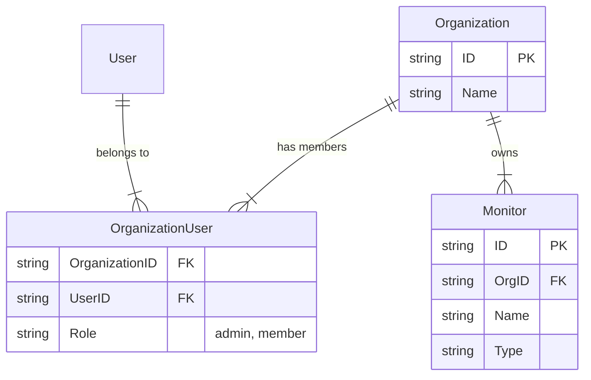

# Multi-tenancy Architecture

Vigi implements a multi-tenant architecture where resources (like Monitors, Status Pages, etc.) belong to an **Organization**. Users can be members of multiple organizations with specific roles.

## Core Concepts

### Organization
The central unit of isolation. All billable resources and operational data are scoped to an Organization.
- **Attributes**: Name, CreatedAt, UpdatedAt.
- **ID**: UUID.

### Organization User
A link table that associates a User with an Organization.
- **Role**:
    - `admin`: Full access to organization settings and members.
    - `member`: Can view and manage resources but cannot manage the organization itself (e.g., billing, members).

### Resource Isolation
Resources such as `Monitors` now have an `org_id` foreign key. API endpoints filter data based on the organization context.

## Data Model

## API Overview

The API exposes endpoints to manage organizations and their members.

### Organizations

- `POST /api/v1/organizations`: Create a new organization. The creator is automatically added as an `admin`.
- `GET /api/v1/organizations/{id}`: Get organization details.

### Members

- `POST /api/v1/organizations/{id}/members`: Add a user to an organization (by user ID).
- `GET /api/v1/organizations/{id}/members`: List all members of an organization.

### User Context

- `GET /api/v1/user/organizations`: List all organizations the authenticated user belongs to.

## Future Improvements

- **RBAC Enforcement**: Currently, the system authenticates users but robust Role-Based Access Control (RBAC) middleware is needed to strictly enforce permissions (e.g., ensuring only `admin` can add members).
- **Billing Integration**: Future billing models will likely be attached to the Organization entity.
