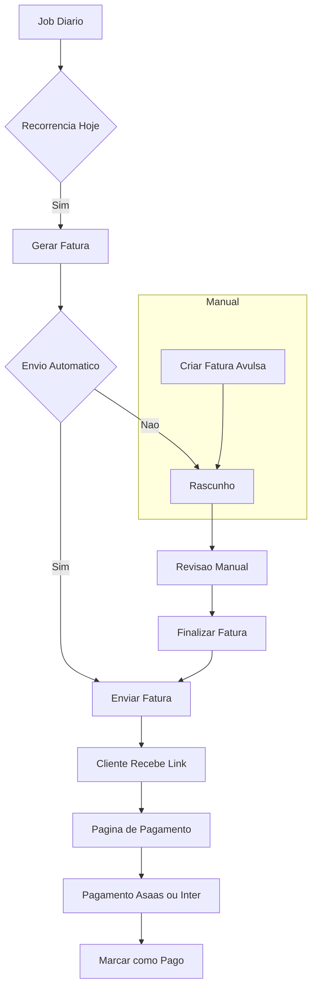
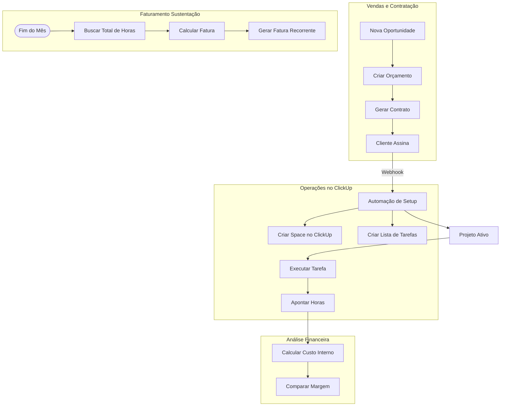

# Vigi: Plataforma de Gestão Financeira e de Projetos

## Visão Geral do Projeto
O Vigi é uma plataforma abrangente para gerenciar as finanças e operações da organização, integrando faturamento, gestão de clientes e execução de projetos. O foco principal é a automação e integração perfeita com ferramentas externas (Bancos, ClickUp, Plataformas de Contrato).

## 1. Módulo Financeiro e de Faturamento

O objetivo principal é controlar faturas recorrentes e avulsas, serviços e interações com clientes.

### Funcionalidades
*   **Tipos de Fatura**: Recorrente (Assinaturas/Sustentação) e Única (Avulsa/One-off).
*   **Catálogo**: Serviços e Itens (ex: "Hospedagem de Servidor", "Horas de Desenvolvimento").
*   **Lógica de Automação**:
    *   **Flag "Enviar Automaticamente"**:
        *   `True`: O sistema gera e envia a fatura automaticamente na data de gatilho.
        *   `False`: O sistema gera o rascunho, mas requer aprovação manual (útil para valores dinâmicos, como consumo medido).
    *   **Job Diário**: Verifica faturas recorrentes agendadas para o dia atual.
*   **Integrações de Pagamento**:
    *   **Asaas**: Pix (QR Dinâmico, validade de 1 ano).
    *   **Inter**: Pix e Boleto.
    *   **Página Pública de Pagamento**: Um link enviado ao cliente (Email/WhatsApp) onde ele pode ver detalhes da fatura e pagar. Opcional: confirmação de token via WhatsApp para acesso.

### Diagrama do Fluxo de Faturamento

## 2. Módulo de Gestão de Projetos

Gerencia o ciclo de vida desde a oportunidade de venda até a entrega do projeto, integrando dados financeiros com a execução operacional.

### Integrações
*   **Plataforma de Contratos**: Para assinaturas digitais.
*   **ClickUp**: Para rastreamento de tarefas e projetos.

### Fluxo: Projetos de Escopo Fechado
1.  **Orçamento/Proposta**: Criar um "Projeto" com status `Orçamento`. Definir escopo e estimar custos.
2.  **Contratação**:
    *   Enviar dados para o **App de Contratos**.
    *   Cliente assina o contrato.
    *   **Gatilho de Webhook**:
        *   Cria **Space** no **ClickUp** para o cliente.
        *   Cria **Lista de Tarefas** a partir de um modelo dentro desse Space.
        *   Atualiza Status do Projeto para `Ativo`.
3.  **Execução e Custeio**:
    *   **Gestão de Recursos**: Definir papéis (ex: Designer, Dev) e taxas de custo (ex: R$30/h).
    *   **Apontamento de Horas**: Desenvolvedores registram horas nas tarefas.
    *   **Análise de Rentabilidade**: Comparar `(Horas Apontadas * Taxa de Custo)` vs `Preço do Projeto`.

### Fluxo: Sustentação / Retainer
Para contratos de suporte contínuo sem escopo fixo.

1.  **Configuração**: Cliente possui um Space dedicado no ClickUp.
2.  **Execução**: Tarefas são criadas e horas apontadas ao longo do mês.
3.  **Rotina de Faturamento** (ex: dia 1 do mês):
    *   Busca todas as horas apontadas no mês anterior para este projeto.
    *   Calcula o Total: `Horas × Taxa Horária` (definida no contrato).
    *   **Gera Fatura Automaticamente** baseada neste cálculo.

### Diagrama de Fluxo Geral e de Projetos

## Próximos Passos
1.  **Implementação Backend**: Implementar a lógica de "Envio Automático" e dependências para Asaas/Inter.
2.  **Integração ClickUp**: Criar módulo para interagir com a API do ClickUp.
3.  **Frontend**: Wizard de Criação de Projeto e Página Pública de Pagamento.
